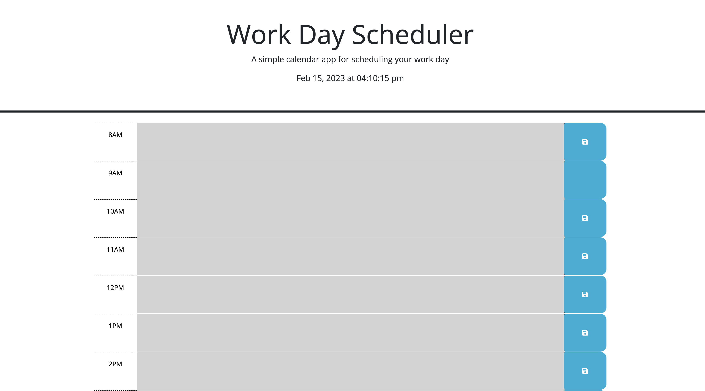

# Work Day Scheduler
## Description
Work day scheduler website by Benjamin Jacquez. A dynamic schedule site allows the user to have an 11 hour long schedule planer. 

## Deployed Website
[Deployed Version Here](https://ben-jacquez.github.io/Work-Day-Scheduler/)

## Table of Contents
- [Description](#description)
- [Deployed Website](#deployed-website)
- [Usage](#usage)
- [Features](#features)
- [License](#license)

## Usage
Open the deployed website and see the 11 different hour blocks with colors coordinated to past, present, or future. There is also a calender and clock for reference at the top of the page. User can also leave strings of text inside the blocks and utilize the save button to store text locally so it will remain even after a page reload.

## Features
- Connected to a 3rd party API which allows for a calender, and clock. Both to display atop the page, and used in the java
- Save feature which allows user inputed text to store locally and stay after page refresh.
- The color of the hour block is coordinated to past (grey), curent (red), or future (green)

## License
MIT License

Copyright (c) 2022 Benjamin Jacquez

Permission is hereby granted, free of charge, to any person obtaining a copy
of this software and associated documentation files (the "Software"), to deal
in the Software without restriction, including without limitation the rights
to use, copy, modify, merge, publish, distribute, sublicense, and/or sell
copies of the Software, and to permit persons to whom the Software is
furnished to do so, subject to the following conditions:

The above copyright notice and this permission notice shall be included in all
copies or substantial portions of the Software.

THE SOFTWARE IS PROVIDED "AS IS", WITHOUT WARRANTY OF ANY KIND, EXPRESS OR
IMPLIED, INCLUDING BUT NOT LIMITED TO THE WARRANTIES OF MERCHANTABILITY,
FITNESS FOR A PARTICULAR PURPOSE AND NONINFRINGEMENT. IN NO EVENT SHALL THE
AUTHORS OR COPYRIGHT HOLDERS BE LIABLE FOR ANY CLAIM, DAMAGES OR OTHER
LIABILITY, WHETHER IN AN ACTION OF CONTRACT, TORT OR OTHERWISE, ARISING FROM,
OUT OF OR IN CONNECTION WITH THE SOFTWARE OR THE USE OR OTHER DEALINGS IN THE
SOFTWARE.